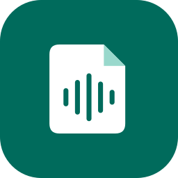

# Persönliche Testversion 0.1.0-preview.1 ausprobieren

App-Version 0.1.0, Versionscode 1; erste markierte Preview, keine vollständige v1.
Android ab API 29 (Android 10), ARM64 oder x86_64. Tatsächlich geprüft wurde bisher
Android 17/API 37/x86_64/16-KB im Emulator; ein physisches ARM64-Handy ist noch offen.

## Installieren und starten

Die persönliche, signierte APK liegt im Projekt unter
`app/build/outputs/apk/release/SourceScribe-0.1.0-preview.1.apk`.
Sie wurde auf dem vorhandenen Emulator als `app.sourcescribe` installiert und
mit echter Caption bis zum dauerhaft gespeicherten Viewer geprüft. Dort ist
Deutsch bereits eingestellt.
Die frühere Debug-App `app.sourcescribe.debug` hat einen separaten Verlauf.

Auf dem Handy die APK persönlich übertragen, in der Dateien-App öffnen und deren
Installationsdialog bestätigen. Falls Android es verlangt, die Installation für
**diese Dateien-App** erlauben; nach der Installation kann diese Erlaubnis wieder
entzogen werden. Das Dokument-/Audiowellen-Icon mit dem Namen SourceScribe starten.
Nicht die Debug-App deinstallieren, wenn deren frühere Testdaten erhalten bleiben sollen.
GitHub enthält vorerst nur den Preview-Quellstand: öffentliche APK-Verteilung ist
wegen fehlender vollständiger FFmpeg-Quell-/Lizenzbelege blockiert.

Bei englischem Start: **More → App language → Deutsch**. Unter **Mehr** lassen
sich außerdem **System**, **Hell** oder **Dunkel** einstellen. App-Sprache und
Transkriptionssprache sind unabhängig. Ohne Benachrichtigungserlaubnis zeigt der
Verlauf den Fortschritt; Androids Hintergrundregeln gelten weiterhin.

## Erster Test ohne STT-Anbieter

1. Unter **Neue Quelle → Beschaffung → Nur YouTube** wählen.
2. Einen öffentlichen YouTube-Einzelvideolink eingeben oder aus YouTube mit
   SourceScribe teilen. **Quelle prüfen** wählen und die Auflösung abwarten.
3. Titel/Quelle und **Untertitelspur** prüfen; dann **Bestätigen und starten**.
4. Unter **Verlauf → Ergebnis öffnen** Herkunft und Text ansehen. Fehlen Captions,
   meldet dieser Modus den Fehler, ohne einen STT-Anbieter aufzurufen.
5. Im Viewer durchsuchen; unter **Aktionen** kopieren/als Datei teilen oder in
   einen selbst gewählten Ordner exportieren. Ohne gewählten Exportordner bleibt das Transkript
   intern erhalten; Export kann später ohne erneute Transkription erfolgen.

## Was enthalten ist

| Bereich | Möglichkeiten |
|---|---|
| Quellen | Explizite YouTube-Einzelvideos per Teilen/Einfügen, mehrere Links mit gemeinsamer Bestätigung, lokale Audiodatei importieren. Ganze Videos; keine automatische Clip-Auswahl durch URL-Zeitmarken. |
| Vier Modi | **Nur YouTube**, **YouTube, sonst STT**, **Nur STT**, **Beides**. Beides erhält zwei getrennte Ergebnisse; ein fehlerhafter Zweig löscht den erfolgreichen nicht. |
| Anbieter | AssemblyAI (US/EU), OpenAI und Groq. Eigene Schlüssel geschützt speichern; Modell und modellabhängige Optionen auswählen. Live-Transkriptionen sind noch nicht durch Entwicklungsagenten geprüft. |
| Expertenoptionen | Caption-Sprachen/-Typen, Übersetzung erlauben, gesonderter Fallback bei Abruffehlern, STT-Sprache, unterstützte Zeit-/Sprecherangaben und Kontextbegriffe; explizite Audio-/Caption-Spuren. |
| Vorgaben | Globale Einstellungen, benannte Presets und Overrides vor Auftragsstart. Bereits laufende Jobs behalten ihren gespeicherten Konfigurationsstand. |
| Grenzen | Audiodauer und lokales Budget, Netzpolitik, 1–4 parallele Jobs, Speicherlimit und Audioaufbewahrung. Budgets sind lokale Schutzgrenzen, keine verbindliche Providerabrechnung. |
| Verlauf | Suche, Phase/Ergebnis/Export getrennt, Abbruch, neue Ausführung, fehlende Arbeit nachholen soweit sicher, anderen Anbieter vorbereiten, Eintrag löschen. AssemblyAI-Remote-Löschung bei vorhandener passender Remote-ID. |
| Ergebnisse | Herkunft, Quelle, Sprache, Modell-/Zeit-/Sprecherdaten soweit vorhanden, Warnungen, Suche auch in langen Transkripten, Kopieren und Android-Dateifreigabe. |
| Export | Markdown, TXT, JSON; SRT/VTT nur mit geeigneten Zeitdaten; Roh-Captions soweit vorhanden. Fehlgeschlagener Export startet keine neue STT-Anfrage. |
| Wartung | Redigierte Diagnose, geprüfte signierte yt-dlp-/EJS-Updates und Rollback. Python/JS-Runtime/FFmpeg benötigen APK-Updates; laufende Jobs behalten ihre Engine. |

Für deinen eigenen STT-Test zuerst unter **Mehr → Zugangsdaten** Anbieter/Region
und API-Schlüssel einrichten. Danach eine kurze eigene Aufnahme über **Audiodatei
importieren** wählen, Modell und Optionen prüfen und bewusst starten. Das umgeht
YouTube als zusätzliche Fehlerquelle. Anschließend YouTube-Audio und Beides testen.
Ein ungewisser Übermittlungsstatus bedeutet: möglicherweise bereits beim Anbieter
angenommen/berechnet; nicht blind neu starten. Ein lokal abgebrochener Remotejob
kann beim Anbieter weiterlaufen.

## TalkBack und bekannte Grenzen

TalkBack ist Googles Android-Screenreader: Er liest Oberflächenelemente vor und
ermöglicht Bedienung ohne den Bildschirm anzusehen. SourceScribe installiert ihn
nicht. Die App stellt zugängliche Beschriftungen und Bedienrollen bereit. Die
frühere unerwartete Sprachausgabe kam von bewusst aktivierten Accessibility-Tests
im Emulator; der Dienst ist jetzt aus. Ohne Bedarf musst du ihn nicht einschalten.
[Offizielle Erklärung](https://support.google.com/accessibility/android/answer/6283677?hl=de).

Noch offen: echte Transkription bei allen drei Anbietern, physisches ARM64,
vollständige TalkBack-Bedienung, ein fehlgeschlagener CI-Gerätelauf mit noch
unbekannter Einzelursache sowie öffentliche APK-Quell-/Lizenzbelege. Der Caption-
Kernpfad ist real geprüft, Providerfehler bisher kontrolliert mit Fixtures.
Keine Zusammenfassungs-API, kein Web-Frontend, kein eigener Backend-Dienst und
keine automatische Ablage in einem bestimmten ChatGPT-Projekt.

## Nützliches Feedback

Bitte Gerät/Android-Version, App-Version, Modus/Anbieter/Modell, genaue Schritte
und erwartetes/tatsächliches Ergebnis nennen. Ein Screenshot zeigt Abstände und
Ausrichtung oft besser als eine Beschreibung. Keine API-Schlüssel mitsenden;
private Textstellen bei Bedarf schwärzen. Bei Fehlern helfen Zeitpunkt und der
angezeigte technische Status. Bekannte Restarbeiten stehen in [NEXT_STEPS](NEXT_STEPS.md).

Das vorhandene adaptive Icon wird nativ aus Vektorpfaden gerendert; hier eine
256-Pixel-Vorschau mit abgerundeter Launcher-Maske, keine neue KI-Grafik:

